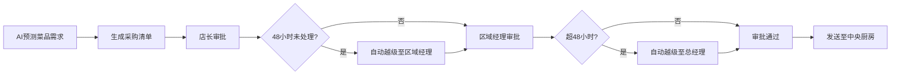
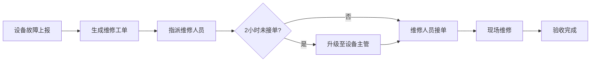

## 1. 产品概述

大型连锁餐饮集团智慧运营与食安管理平台，整合需求预测、采购审批、中央厨房排产、冷链配送、食安巡检、会员管理、财务对账等核心业务，实现全链条数字化管控，提升运营效率，保障食品安全。

- 核心目标：通过 AI 预测和自动化流程，降低运营成本 30%，食安事件响应时间缩短 80%
- 目标用户：集团总经理、区域经理、店长、财务人员、食安巡检员、门店店员
- 覆盖范围：全国 200+ 门店、5 大区域、3 个中央厨房、10+ 冷链配送线路

## 2. 核心功能

### 2.1 用户角色与权限

| 角色 | 权限等级 | 核心权限 |
|------|----------|----------|
| 店员 | L1 | 查看本店数据、执行日常操作 |
| 店长 | L2 | 管理门店、审批采购申请、处理食安工单 |
| 区域经理 | L3 | 管理片区门店、审批重要工单、查看区域报表 |
| 财务 | L4 | 查看成本数据、对账管理、财务报表 |
| 总经理 | L5 | 全局管理、调整审批规则、查看集团报表 |

### 2.2 功能模块

1. **首页大屏**：实时营收、食安达标率、配送状态、销量排行（5秒刷新）
2. **需求预测与采购**：AI 预测菜品需求、生成采购清单、多级审批（48小时自动越级）
3. **中央厨房管理**：自动排产、设备管理、维修工单（2小时未接单升级）
4. **冷链配送调度**：智能调度、温控监控、超温报警、应急补货
5. **食安巡检与追溯**：扫码打卡、过期/变质检测、下架召回、供应商追溯
6. **会员系统**：消费分析、优惠券推送、积分自动升降级
7. **财务模块**：每日流水汇总、对账异常核查、成本分析
8. **系统管理**：权限管理、审批规则配置、数据导出

### 2.3 页面详情

| 页面名称 | 模块名称 | 功能描述 |
|---------|----------|----------|
| 首页大屏 | 数据看板 | 实时营收统计、食安达标率、配送在途状态、菜品销量排行、区域/门店/日期筛选、数据5秒自动刷新 |
| 需求预测 | 预测管理 | 历史销量分析、天气数据对接、AI 需求预测、预测结果调整 |
| 采购管理 | 采购审批 | 自动生成采购清单、多级审批流程、48小时未处理自动越级、审批状态追踪 |
| 中央厨房 | 生产排程 | 订单自动排产、生产进度监控、设备状态管理 |
| 设备管理 | 维修工单 | 故障报修、工单指派、2小时未接单升级、维修状态追踪 |
| 冷链配送 | 调度中心 | 车辆智能调度、实时路况、温控监控、超温报警、应急补货 |
| 食安巡检 | 巡检管理 | 扫码打卡、问题上报、一键下架/召回、审批流程、供应商追溯 |
| 会员管理 | 会员中心 | 会员画像、消费频次分析、口味偏好、优惠券推送、积分升降级 |
| 财务中心 | 财务管理 | 每日流水、对账管理、异常核查、成本控制明细 |
| 报表中心 | 报表导出 | 月度运营分析报告、成本控制明细、一键导出 Excel |
| 系统设置 | 权限管理 | 用户管理、角色分配、审批规则配置 |

## 3. 核心流程

### 3.1 采购审批流程

### 3.2 食安巡检流程

### 3.3 冷链配送流程

### 3.4 维修工单流程

## 4. 用户界面设计

### 4.1 设计风格

**视觉定位：工业智能风，专业、高效、可信赖**

- **主色调**：深蓝色 `#0F2B5B`（专业、稳重）
- **辅助色**：科技蓝 `#2563EB`（数据可视化）、警示红 `#DC2626`（告警）、成功绿 `#16A34A`（正常）、警告橙 `#F59E0B`（预警）
- **背景**：深色渐变 `#0B1220` → `#111827`，搭配微妙网格纹理
- **字体**：
  - 标题：`Space Grotesk`，现代无衬线，科技感
  - 正文：`Inter`，清晰易读
- **按钮风格**：直角渐变，轻微悬停抬升效果
- **卡片风格**：半透明玻璃拟态，微妙边框，投影柔和
- **图标**：`lucide-react` 线性图标，统一 24px

### 4.2 页面设计概览

| 页面名称 | 模块名称 | UI 设计要点 |
|---------|----------|-------------|
| 首页大屏 | 数据看板 | 全屏深色主题、数据卡片网格布局、实时数据脉冲动画、图表联动、滚动通知栏 |
| 采购管理 | 列表详情 | 时间线审批流程、状态标签、超时警告、操作按钮组 |
| 冷链配送 | 地图调度 | 地图可视化、车辆实时轨迹、温控曲线、异常标记闪烁 |
| 食安巡检 | 工单处理 | 扫码入口、问题拍照上传、追溯链路图、审批节点高亮 |
| 会员管理 | 用户画像 | 用户卡片轮播、消费雷达图、偏好标签云、推送历史 |
| 财务中心 | 数据报表 | 流水表格、对账差异高亮、趋势折线图、成本构成饼图 |

### 4.3 响应式设计

- **桌面优先**：优化 1920×1080 及以上大屏展示，首页大屏支持全屏模式
- **平板适配**：1024px 断点，侧边栏收起，卡片自动换行
- **移动适配**：768px 断点，底部导航，单列布局，触控优化
- **交互优化**：支持键盘快捷键、大屏触控、鼠标悬停详情

### 4.4 动效与交互

- **数据刷新**：数字滚动动画（count-up），新数据脉冲闪烁
- **告警提示**：红色呼吸灯效果，声音提醒（可静音）
- **页面切换**：淡入淡出 + 滑动过渡，200ms 缓动
- **图表交互**：悬停高亮、点击下钻、缩放平移
- **加载状态**：骨架屏 + 进度条，避免空白闪烁
