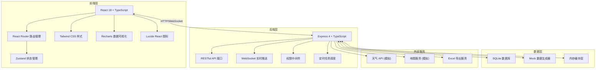
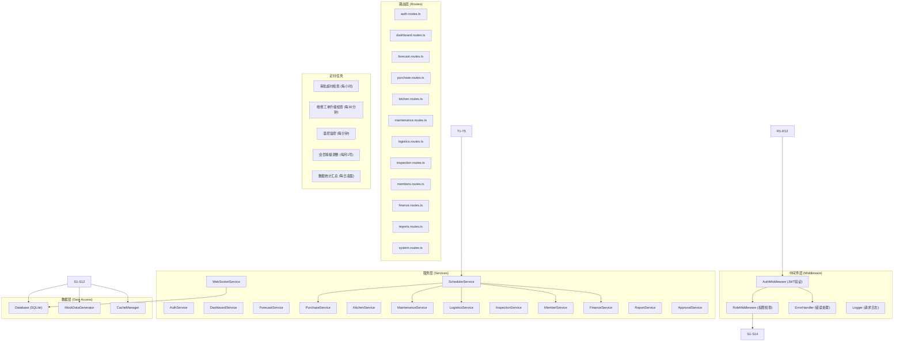

## 1. 架构设计



## 2. 技术描述

- **前端框架**: React 18 + TypeScript
- **构建工具**: Vite 5
- **状态管理**: Zustand 4
- **路由管理**: React Router DOM 6
- **样式方案**: Tailwind CSS 3
- **图表库**: Recharts 2
- **图标库**: Lucide React
- **后端框架**: Express 4 + TypeScript
- **数据库**: SQLite (开发阶段)
- **实时通信**: WebSocket (ws 库)
- **HTTP 客户端**: Axios
- **Excel 导出**: xlsx 库
- **日期处理**: dayjs

## 3. 前端路由定义

| 路由路径 | 页面名称 | 权限等级 |
|---------|----------|----------|
| `/login` | 登录页 | - |
| `/dashboard` | 首页大屏 | L1-L5 |
| `/forecast` | 需求预测 | L2-L5 |
| `/purchase` | 采购管理 | L2-L5 |
| `/kitchen` | 中央厨房 | L2-L5 |
| `/maintenance` | 设备管理 | L2-L5 |
| `/logistics` | 冷链配送 | L2-L5 |
| `/inspection` | 食安巡检 | L2-L5 |
| `/members` | 会员管理 | L2-L5 |
| `/finance` | 财务中心 | L4-L5 |
| `/reports` | 报表中心 | L3-L5 |
| `/settings` | 系统设置 | L5 |

## 4. 后端 API 定义

### 4.1 TypeScript 类型定义

```typescript
// 通用类型
interface ApiResponse<T> {
  code: number;
  message: string;
  data: T;
}

interface PaginationParams {
  page: number;
  pageSize: number;
}

interface PaginationResult<T> {
  list: T[];
  total: number;
  page: number;
  pageSize: number;
}

// 用户与权限
interface User {
  id: string;
  username: string;
  name: string;
  role: 'staff' | 'manager' | 'regional' | 'finance' | 'general';
  roleLevel: 1 | 2 | 3 | 4 | 5;
  storeId?: string;
  regionId?: string;
  avatar?: string;
}

interface LoginRequest {
  username: string;
  password: string;
}

interface LoginResponse {
  token: string;
  user: User;
}

// 门店
interface Store {
  id: string;
  name: string;
  address: string;
  regionId: string;
  managerId: string;
  phone: string;
  status: 'open' | 'closed' | 'maintenance';
  dailyTarget: number;
}

// 菜品
interface Dish {
  id: string;
  name: string;
  category: string;
  price: number;
  cost: number;
  ingredients: string[];
  shelfLife: number;
}

// 需求预测
interface ForecastItem {
  id: string;
  storeId: string;
  dishId: string;
  dishName: string;
  forecastDate: string;
  forecastQuantity: number;
  historicalData: number[];
  weatherFactor: number;
  confidence: number;
  status: 'draft' | 'confirmed' | 'adjusted';
}

// 采购申请
interface PurchaseOrder {
  id: string;
  orderNo: string;
  storeId: string;
  storeName: string;
  forecastId: string;
  items: PurchaseItem[];
  totalAmount: number;
  status: 'pending' | 'approved_store' | 'approved_region' | 'approved_general' | 'rejected' | 'completed' | 'escalated';
  currentApprover: string;
  createdAt: string;
  escalatedAt?: string;
  approvalHistory: ApprovalRecord[];
}

interface PurchaseItem {
  id: string;
  materialName: string;
  specification: string;
  quantity: number;
  unit: string;
  unitPrice: number;
  subtotal: number;
}

interface ApprovalRecord {
  id: string;
  approverId: string;
  approverName: string;
  role: string;
  action: 'approve' | 'reject' | 'escalate';
  comment: string;
  createdAt: string;
}

// 中央厨房排产
interface ProductionPlan {
  id: string;
  planNo: string;
  kitchenId: string;
  date: string;
  items: ProductionItem[];
  status: 'scheduled' | 'in_progress' | 'completed';
  createdAt: string;
}

interface ProductionItem {
  id: string;
  dishId: string;
  dishName: string;
  plannedQuantity: number;
  actualQuantity: number;
  startTime?: string;
  endTime?: string;
  status: 'pending' | 'processing' | 'completed';
}

// 设备管理
interface Equipment {
  id: string;
  name: string;
  model: string;
  location: string;
  status: 'normal' | 'warning' | 'fault' | 'maintenance';
  lastMaintenance: string;
  nextMaintenance: string;
}

interface MaintenanceWorkOrder {
  id: string;
  orderNo: string;
  equipmentId: string;
  equipmentName: string;
  faultDescription: string;
  reporterId: string;
  reporterName: string;
  assigneeId?: string;
  assigneeName?: string;
  status: 'pending' | 'assigned' | 'accepted' | 'in_progress' | 'completed' | 'escalated';
  priority: 'low' | 'medium' | 'high' | 'urgent';
  createdAt: string;
  escalatedAt?: string;
  acceptedAt?: string;
  completedAt?: string;
}

// 冷链配送
interface DeliveryOrder {
  id: string;
  orderNo: string;
  storeId: string;
  storeName: string;
  vehicleId: string;
  driverName: string;
  items: DeliveryItem[];
  temperatureLog: TemperatureRecord[];
  status: 'scheduled' | 'loading' | 'in_transit' | 'arrived' | 'delayed' | 'alert';
  currentTemperature: number;
  targetTemperature: { min: number; max: number };
  estimatedArrival: string;
  actualArrival?: string;
  route: RoutePoint[];
}

interface DeliveryItem {
  id: string;
  materialName: string;
  quantity: number;
  unit: string;
}

interface TemperatureRecord {
  timestamp: string;
  temperature: number;
  location: string;
}

interface RoutePoint {
  timestamp: string;
  lat: number;
  lng: number;
  address: string;
}

// 食安巡检
interface InspectionRecord {
  id: string;
  inspectorId: string;
  inspectorName: string;
  storeId: string;
  storeName: string;
  checkInTime: string;
  checkOutTime?: string;
  items: InspectionItem[];
  issues: IssueRecord[];
  status: 'in_progress' | 'completed' | 'issue_found';
}

interface InspectionItem {
  id: string;
  name: string;
  category: string;
  result: 'pass' | 'fail' | 'warning';
  remark?: string;
  photoUrl?: string;
}

interface IssueRecord {
  id: string;
  description: string;
  type: 'expired' | 'deteriorated' | 'hygiene' | 'temperature' | 'other';
  severity: 'low' | 'medium' | 'high' | 'critical';
  photos: string[];
  workOrderId?: string;
}

interface RecallWorkOrder {
  id: string;
  orderNo: string;
  issueId: string;
  type: 'remove' | 'recall';
  productName: string;
  batchNo: string;
  affectedStores: string[];
  supplierId: string;
  supplierName: string;
  status: 'pending_approval' | 'approved_store' | 'approved_region' | 'executing' | 'completed';
  approvalHistory: ApprovalRecord[];
  traceability: TraceabilityNode[];
}

interface TraceabilityNode {
  id: string;
  nodeType: 'supplier' | 'warehouse' | 'kitchen' | 'store';
  name: string;
  inTime: string;
  outTime?: string;
  operator: string;
}

// 会员
interface Member {
  id: string;
  memberNo: string;
  name: string;
  phone: string;
  level: 'bronze' | 'silver' | 'gold' | 'platinum' | 'diamond';
  points: number;
  totalSpent: number;
  visitCount: number;
  lastVisit: string;
  tastePreferences: string[];
  coupons: Coupon[];
  consumptionHistory: ConsumptionRecord[];
}

interface Coupon {
  id: string;
  name: string;
  type: 'discount' | 'amount' | 'gift';
  value: number;
  condition: number;
  expireDate: string;
  status: 'unused' | 'used' | 'expired';
}

interface ConsumptionRecord {
  id: string;
  date: string;
  storeId: string;
  storeName: string;
  amount: number;
  dishes: string[];
  pointsEarned: number;
}

// 财务
interface DailyTransaction {
  id: string;
  date: string;
  storeId: string;
  storeName: string;
  totalRevenue: number;
  cashRevenue: number;
  digitalRevenue: number;
  memberRevenue: number;
  cost: number;
  profit: number;
  orderCount: number;
  avgOrderAmount: number;
}

interface ReconciliationRecord {
  id: string;
  date: string;
  storeId: string;
  expectedAmount: number;
  actualAmount: number;
  difference: number;
  status: 'matched' | 'mismatch' | 'investigating' | 'resolved';
  remark?: string;
}

// 首页统计
interface DashboardStats {
  totalRevenue: number;
  revenueGrowth: number;
  orderCount: number;
  orderGrowth: number;
  foodSafetyRate: number;
  activeStores: number;
  totalStores: number;
  deliveriesInTransit: number;
  alertDeliveries: number;
  topDishes: { name: string; sales: number; trend: number }[];
  recentAlerts: AlertItem[];
  hourlyRevenue: { hour: string; revenue: number }[];
  regionalRevenue: { region: string; revenue: number; target: number }[];
}

interface AlertItem {
  id: string;
  type: 'food_safety' | 'temperature' | 'equipment' | 'approval' | 'reconciliation';
  title: string;
  description: string;
  severity: 'low' | 'medium' | 'high' | 'critical';
  storeName: string;
  createdAt: string;
}
```

### 4.2 API 接口列表

| 方法 | 路径 | 描述 | 权限 |
|------|------|------|------|
| POST | `/api/auth/login` | 用户登录 | - |
| GET | `/api/auth/profile` | 获取当前用户信息 | L1-L5 |
| GET | `/api/dashboard/stats` | 获取首页统计数据 | L1-L5 |
| GET | `/api/dashboard/alerts` | 获取实时告警列表 | L1-L5 |
| GET | `/api/forecast` | 获取需求预测列表 | L2-L5 |
| POST | `/api/forecast/generate` | 生成预测数据 | L2-L5 |
| PUT | `/api/forecast/:id` | 调整预测数据 | L2-L5 |
| GET | `/api/purchase` | 获取采购订单列表 | L2-L5 |
| POST | `/api/purchase` | 创建采购订单 | L2-L5 |
| POST | `/api/purchase/:id/approve` | 审批采购订单 | L2-L5 |
| POST | `/api/purchase/:id/reject` | 拒绝采购订单 | L2-L5 |
| GET | `/api/kitchen/production` | 获取生产计划 | L2-L5 |
| POST | `/api/kitchen/production/generate` | 自动排产 | L2-L5 |
| PUT | `/api/kitchen/production/:id/status` | 更新生产状态 | L2-L5 |
| GET | `/api/equipment` | 获取设备列表 | L2-L5 |
| GET | `/api/maintenance` | 获取维修工单列表 | L2-L5 |
| POST | `/api/maintenance` | 创建维修工单 | L2-L5 |
| POST | `/api/maintenance/:id/assign` | 指派维修工单 | L2-L5 |
| POST | `/api/maintenance/:id/accept` | 接受维修工单 | L2-L5 |
| POST | `/api/maintenance/:id/complete` | 完成维修工单 | L2-L5 |
| GET | `/api/logistics/delivery` | 获取配送订单列表 | L2-L5 |
| GET | `/api/logistics/delivery/:id` | 获取配送详情 | L2-L5 |
| GET | `/api/logistics/temperature/:id` | 获取温控记录 | L2-L5 |
| POST | `/api/logistics/emergency-replenish` | 触发应急补货 | L2-L5 |
| GET | `/api/inspection` | 获取巡检记录 | L2-L5 |
| POST | `/api/inspection/checkin` | 扫码打卡 | L2-L5 |
| POST | `/api/inspection/report-issue` | 上报问题 | L2-L5 |
| POST | `/api/inspection/checkout` | 完成巡检 | L2-L5 |
| GET | `/api/recall` | 获取召回工单列表 | L2-L5 |
| POST | `/api/recall` | 创建下架/召回工单 | L2-L5 |
| POST | `/api/recall/:id/approve` | 审批召回工单 | L2-L5 |
| GET | `/api/recall/:id/traceability` | 获取追溯链路 | L2-L5 |
| GET | `/api/members` | 获取会员列表 | L2-L5 |
| GET | `/api/members/:id` | 获取会员详情 | L2-L5 |
| POST | `/api/members/:id/send-coupon` | 推送优惠券 | L2-L5 |
| POST | `/api/members/process-levels` | 处理会员升降级 | L3-L5 |
| GET | `/api/finance/transactions` | 获取每日流水 | L4-L5 |
| GET | `/api/finance/reconciliation` | 获取对账记录 | L4-L5 |
| POST | `/api/finance/reconciliation/:id/investigate` | 触发对账核查 | L4-L5 |
| GET | `/api/finance/cost-details` | 获取成本明细 | L4-L5 |
| GET | `/api/reports/operation` | 导出月度运营报告 | L3-L5 |
| GET | `/api/reports/cost-control` | 导出成本控制明细 | L3-L5 |
| GET | `/api/stores` | 获取门店列表 | L1-L5 |
| GET | `/api/regions` | 获取区域列表 | L1-L5 |
| GET | `/api/users` | 获取用户列表 | L5 |
| POST | `/api/users` | 创建用户 | L5 |
| PUT | `/api/users/:id` | 更新用户信息 | L5 |
| GET | `/api/approval-rules` | 获取审批规则 | L5 |
| PUT | `/api/approval-rules` | 更新审批规则 | L5 |

## 5. 服务器架构图



## 6. 数据模型

### 6.1 ER 图

```mermaid
erDiagram
    USER ||--o{ PURCHASE_ORDER : "审批"
    USER ||--o{ MAINTENANCE_WORK_ORDER : "指派/处理"
    USER ||--o{ INSPECTION_RECORD : "执行"
    USER ||--o{ RECALL_WORK_ORDER : "审批"
    USER }o--|| STORE : "所属"
    USER }o--|| REGION : "所属"
    
    STORE ||--o{ PURCHASE_ORDER : "发起"
    STORE ||--o{ DAILY_TRANSACTION : "产生"
    STORE ||--o{ DELIVERY_ORDER : "接收"
    STORE ||--o{ INSPECTION_RECORD : "被检查"
    STORE }o--|| REGION : "属于"
    
    DISH ||--o{ FORECAST_ITEM : "预测"
    DISH ||--o{ PRODUCTION_ITEM : "生产"
    
    FORECAST_ITEM ||--o| PURCHASE_ORDER : "生成"
    
    PURCHASE_ORDER ||--|{ PURCHASE_ITEM : "包含"
    PURCHASE_ORDER ||--|{ APPROVAL_RECORD : "有"
    
    PRODUCTION_PLAN ||--|{ PRODUCTION_ITEM : "包含"
    
    EQUIPMENT ||--o{ MAINTENANCE_WORK_ORDER : "产生"
    
    DELIVERY_ORDER ||--|{ DELIVERY_ITEM : "包含"
    DELIVERY_ORDER ||--|{ TEMPERATURE_RECORD : "有"
    DELIVERY_ORDER ||--|{ ROUTE_POINT : "有"
    
    INSPECTION_RECORD ||--|{ INSPECTION_ITEM : "检查"
    INSPECTION_RECORD ||--o{ ISSUE_RECORD : "发现"
    
    ISSUE_RECORD ||--o| RECALL_WORK_ORDER : "触发"
    
    RECALL_WORK_ORDER ||--|{ APPROVAL_RECORD : "有"
    RECALL_WORK_ORDER ||--|{ TRACEABILITY_NODE : "追溯"
    RECALL_WORK_ORDER }o--|| SUPPLIER : "关联"
    
    MEMBER ||--|{ CONSUMPTION_RECORD : "消费"
    MEMBER ||--o{ COUPON : "持有"
    
    DAILY_TRANSACTION ||--o| RECONCILIATION_RECORD : "对账"

    USER {
        string id PK
        string username
        string name
        string password_hash
        string role
        int role_level
        string store_id FK
        string region_id FK
        string avatar
        datetime created_at
    }
    
    REGION {
        string id PK
        string name
        string manager_id FK
        datetime created_at
    }
    
    STORE {
        string id PK
        string name
        string address
        string region_id FK
        string manager_id FK
        string phone
        string status
        decimal daily_target
        datetime created_at
    }
    
    DISH {
        string id PK
        string name
        string category
        decimal price
        decimal cost
        text ingredients
        int shelf_life
        datetime created_at
    }
    
    FORECAST_ITEM {
        string id PK
        string store_id FK
        string dish_id FK
        date forecast_date
        int forecast_quantity
        text historical_data
        decimal weather_factor
        decimal confidence
        string status
        datetime created_at
    }
    
    PURCHASE_ORDER {
        string id PK
        string order_no
        string store_id FK
        string forecast_id FK
        decimal total_amount
        string status
        string current_approver
        datetime escalated_at
        datetime created_at
    }
    
    PURCHASE_ITEM {
        string id PK
        string purchase_order_id FK
        string material_name
        string specification
        decimal quantity
        string unit
        decimal unit_price
        decimal subtotal
    }
    
    APPROVAL_RECORD {
        string id PK
        string order_id FK
        string approver_id FK
        string approver_name
        string role
        string action
        text comment
        datetime created_at
    }
    
    PRODUCTION_PLAN {
        string id PK
        string plan_no
        string kitchen_id
        date date
        string status
        datetime created_at
    }
    
    PRODUCTION_ITEM {
        string id PK
        string production_plan_id FK
        string dish_id FK
        int planned_quantity
        int actual_quantity
        datetime start_time
        datetime end_time
        string status
    }
    
    EQUIPMENT {
        string id PK
        string name
        string model
        string location
        string status
        date last_maintenance
        date next_maintenance
    }
    
    MAINTENANCE_WORK_ORDER {
        string id PK
        string order_no
        string equipment_id FK
        text fault_description
        string reporter_id FK
        string assignee_id FK
        string status
        string priority
        datetime escalated_at
        datetime accepted_at
        datetime completed_at
        datetime created_at
    }
    
    DELIVERY_ORDER {
        string id PK
        string order_no
        string store_id FK
        string vehicle_id
        string driver_name
        decimal current_temperature
        decimal target_temp_min
        decimal target_temp_max
        string status
        datetime estimated_arrival
        datetime actual_arrival
    }
    
    DELIVERY_ITEM {
        string id PK
        string delivery_order_id FK
        string material_name
        decimal quantity
        string unit
    }
    
    TEMPERATURE_RECORD {
        string id PK
        string delivery_order_id FK
        datetime timestamp
        decimal temperature
        string location
    }
    
    ROUTE_POINT {
        string id PK
        string delivery_order_id FK
        datetime timestamp
        decimal lat
        decimal lng
        string address
    }
    
    INSPECTION_RECORD {
        string id PK
        string inspector_id FK
        string store_id FK
        datetime check_in_time
        datetime check_out_time
        string status
    }
    
    INSPECTION_ITEM {
        string id PK
        string inspection_id FK
        string name
        string category
        string result
        text remark
        string photo_url
    }
    
    ISSUE_RECORD {
        string id PK
        string inspection_id FK
        text description
        string type
        string severity
        text photos
        string work_order_id FK
        datetime created_at
    }
    
    RECALL_WORK_ORDER {
        string id PK
        string order_no
        string issue_id FK
        string type
        string product_name
        string batch_no
        text affected_stores
        string supplier_id FK
        string status
        datetime created_at
    }
    
    TRACEABILITY_NODE {
        string id PK
        string recall_order_id FK
        string node_type
        string name
        datetime in_time
        datetime out_time
        string operator
    }
    
    SUPPLIER {
        string id PK
        string name
        string contact
        string phone
        string address
        string qualification
    }
    
    MEMBER {
        string id PK
        string member_no
        string name
        string phone
        string level
        int points
        decimal total_spent
        int visit_count
        date last_visit
        text taste_preferences
    }
    
    COUPON {
        string id PK
        string member_id FK
        string name
        string type
        decimal value
        decimal condition
        date expire_date
        string status
    }
    
    CONSUMPTION_RECORD {
        string id PK
        string member_id FK
        date date
        string store_id FK
        decimal amount
        text dishes
        int points_earned
    }
    
    DAILY_TRANSACTION {
        string id PK
        date date
        string store_id FK
        decimal total_revenue
        decimal cash_revenue
        decimal digital_revenue
        decimal member_revenue
        decimal cost
        decimal profit
        int order_count
        decimal avg_order_amount
    }
    
    RECONCILIATION_RECORD {
        string id PK
        date date
        string store_id FK
        decimal expected_amount
        decimal actual_amount
        decimal difference
        string status
        text remark
    }
    
    APPROVAL_RULE {
        string id PK
        string process_type
        int level_1_threshold
        int level_2_threshold
        int level_3_threshold
        int escalation_hours
        datetime updated_at
    }
```



### 6.2 DDL 语句

```sql
-- 用户表
CREATE TABLE users (
  id TEXT PRIMARY KEY,
  username TEXT UNIQUE NOT NULL,
  name TEXT NOT NULL,
  password_hash TEXT NOT NULL,
  role TEXT NOT NULL CHECK (role IN ('staff', 'manager', 'regional', 'finance', 'general')),
  role_level INTEGER NOT NULL CHECK (role_level BETWEEN 1 AND 5),
  store_id TEXT,
  region_id TEXT,
  avatar TEXT,
  created_at DATETIME DEFAULT CURRENT_TIMESTAMP,
  FOREIGN KEY (store_id) REFERENCES stores(id),
  FOREIGN KEY (region_id) REFERENCES regions(id)
);

-- 区域表
CREATE TABLE regions (
  id TEXT PRIMARY KEY,
  name TEXT NOT NULL,
  manager_id TEXT,
  created_at DATETIME DEFAULT CURRENT_TIMESTAMP,
  FOREIGN KEY (manager_id) REFERENCES users(id)
);

-- 门店表
CREATE TABLE stores (
  id TEXT PRIMARY KEY,
  name TEXT NOT NULL,
  address TEXT NOT NULL,
  region_id TEXT NOT NULL,
  manager_id TEXT,
  phone TEXT,
  status TEXT NOT NULL DEFAULT 'open' CHECK (status IN ('open', 'closed', 'maintenance')),
  daily_target REAL DEFAULT 0,
  created_at DATETIME DEFAULT CURRENT_TIMESTAMP,
  FOREIGN KEY (region_id) REFERENCES regions(id),
  FOREIGN KEY (manager_id) REFERENCES users(id)
);

-- 菜品表
CREATE TABLE dishes (
  id TEXT PRIMARY KEY,
  name TEXT NOT NULL,
  category TEXT NOT NULL,
  price REAL NOT NULL,
  cost REAL NOT NULL,
  ingredients TEXT,
  shelf_life INTEGER DEFAULT 24,
  created_at DATETIME DEFAULT CURRENT_TIMESTAMP
);

-- 需求预测表
CREATE TABLE forecast_items (
  id TEXT PRIMARY KEY,
  store_id TEXT NOT NULL,
  dish_id TEXT NOT NULL,
  dish_name TEXT NOT NULL,
  forecast_date DATE NOT NULL,
  forecast_quantity INTEGER NOT NULL,
  historical_data TEXT,
  weather_factor REAL DEFAULT 1,
  confidence REAL DEFAULT 0.85,
  status TEXT NOT NULL DEFAULT 'draft' CHECK (status IN ('draft', 'confirmed', 'adjusted')),
  created_at DATETIME DEFAULT CURRENT_TIMESTAMP,
  FOREIGN KEY (store_id) REFERENCES stores(id),
  FOREIGN KEY (dish_id) REFERENCES dishes(id)
);

-- 采购订单表
CREATE TABLE purchase_orders (
  id TEXT PRIMARY KEY,
  order_no TEXT UNIQUE NOT NULL,
  store_id TEXT NOT NULL,
  store_name TEXT NOT NULL,
  forecast_id TEXT,
  total_amount REAL NOT NULL DEFAULT 0,
  status TEXT NOT NULL DEFAULT 'pending' CHECK (status IN ('pending', 'approved_store', 'approved_region', 'approved_general', 'rejected', 'completed', 'escalated')),
  current_approver TEXT,
  escalated_at DATETIME,
  created_at DATETIME DEFAULT CURRENT_TIMESTAMP,
  FOREIGN KEY (store_id) REFERENCES stores(id)
);

-- 采购明细表
CREATE TABLE purchase_items (
  id TEXT PRIMARY KEY,
  purchase_order_id TEXT NOT NULL,
  material_name TEXT NOT NULL,
  specification TEXT,
  quantity REAL NOT NULL,
  unit TEXT NOT NULL,
  unit_price REAL NOT NULL,
  subtotal REAL NOT NULL,
  FOREIGN KEY (purchase_order_id) REFERENCES purchase_orders(id)
);

-- 审批记录表
CREATE TABLE approval_records (
  id TEXT PRIMARY KEY,
  order_id TEXT NOT NULL,
  approver_id TEXT NOT NULL,
  approver_name TEXT NOT NULL,
  role TEXT NOT NULL,
  action TEXT NOT NULL CHECK (action IN ('approve', 'reject', 'escalate')),
  comment TEXT,
  created_at DATETIME DEFAULT CURRENT_TIMESTAMP
);

-- 生产计划表
CREATE TABLE production_plans (
  id TEXT PRIMARY KEY,
  plan_no TEXT UNIQUE NOT NULL,
  kitchen_id TEXT NOT NULL,
  date DATE NOT NULL,
  status TEXT NOT NULL DEFAULT 'scheduled' CHECK (status IN ('scheduled', 'in_progress', 'completed')),
  created_at DATETIME DEFAULT CURRENT_TIMESTAMP
);

-- 生产明细表
CREATE TABLE production_items (
  id TEXT PRIMARY KEY,
  production_plan_id TEXT NOT NULL,
  dish_id TEXT NOT NULL,
  dish_name TEXT NOT NULL,
  planned_quantity INTEGER NOT NULL,
  actual_quantity INTEGER DEFAULT 0,
  start_time DATETIME,
  end_time DATETIME,
  status TEXT NOT NULL DEFAULT 'pending' CHECK (status IN ('pending', 'processing', 'completed')),
  FOREIGN KEY (production_plan_id) REFERENCES production_plans(id)
);

-- 设备表
CREATE TABLE equipments (
  id TEXT PRIMARY KEY,
  name TEXT NOT NULL,
  model TEXT NOT NULL,
  location TEXT NOT NULL,
  status TEXT NOT NULL DEFAULT 'normal' CHECK (status IN ('normal', 'warning', 'fault', 'maintenance')),
  last_maintenance DATE,
  next_maintenance DATE
);

-- 维修工单表
CREATE TABLE maintenance_work_orders (
  id TEXT PRIMARY KEY,
  order_no TEXT UNIQUE NOT NULL,
  equipment_id TEXT NOT NULL,
  equipment_name TEXT NOT NULL,
  fault_description TEXT NOT NULL,
  reporter_id TEXT NOT NULL,
  reporter_name TEXT NOT NULL,
  assignee_id TEXT,
  assignee_name TEXT,
  status TEXT NOT NULL DEFAULT 'pending' CHECK (status IN ('pending', 'assigned', 'accepted', 'in_progress', 'completed', 'escalated')),
  priority TEXT NOT NULL DEFAULT 'medium' CHECK (priority IN ('low', 'medium', 'high', 'urgent')),
  escalated_at DATETIME,
  accepted_at DATETIME,
  completed_at DATETIME,
  created_at DATETIME DEFAULT CURRENT_TIMESTAMP,
  FOREIGN KEY (equipment_id) REFERENCES equipments(id)
);

-- 配送订单表
CREATE TABLE delivery_orders (
  id TEXT PRIMARY KEY,
  order_no TEXT UNIQUE NOT NULL,
  store_id TEXT NOT NULL,
  store_name TEXT NOT NULL,
  vehicle_id TEXT NOT NULL,
  driver_name TEXT NOT NULL,
  current_temperature REAL NOT NULL,
  target_temp_min REAL NOT NULL,
  target_temp_max REAL NOT NULL,
  status TEXT NOT NULL DEFAULT 'scheduled' CHECK (status IN ('scheduled', 'loading', 'in_transit', 'arrived', 'delayed', 'alert')),
  estimated_arrival DATETIME,
  actual_arrival DATETIME,
  created_at DATETIME DEFAULT CURRENT_TIMESTAMP,
  FOREIGN KEY (store_id) REFERENCES stores(id)
);

-- 配送明细表
CREATE TABLE delivery_items (
  id TEXT PRIMARY KEY,
  delivery_order_id TEXT NOT NULL,
  material_name TEXT NOT NULL,
  quantity REAL NOT NULL,
  unit TEXT NOT NULL,
  FOREIGN KEY (delivery_order_id) REFERENCES delivery_orders(id)
);

-- 温控记录表
CREATE TABLE temperature_records (
  id TEXT PRIMARY KEY,
  delivery_order_id TEXT NOT NULL,
  timestamp DATETIME NOT NULL,
  temperature REAL NOT NULL,
  location TEXT,
  FOREIGN KEY (delivery_order_id) REFERENCES delivery_orders(id)
);

-- 路径点表
CREATE TABLE route_points (
  id TEXT PRIMARY KEY,
  delivery_order_id TEXT NOT NULL,
  timestamp DATETIME NOT NULL,
  lat REAL NOT NULL,
  lng REAL NOT NULL,
  address TEXT,
  FOREIGN KEY (delivery_order_id) REFERENCES delivery_orders(id)
);

-- 巡检记录表
CREATE TABLE inspection_records (
  id TEXT PRIMARY KEY,
  inspector_id TEXT NOT NULL,
  inspector_name TEXT NOT NULL,
  store_id TEXT NOT NULL,
  store_name TEXT NOT NULL,
  check_in_time DATETIME NOT NULL,
  check_out_time DATETIME,
  status TEXT NOT NULL DEFAULT 'in_progress' CHECK (status IN ('in_progress', 'completed', 'issue_found')),
  FOREIGN KEY (store_id) REFERENCES stores(id)
);

-- 巡检项目表
CREATE TABLE inspection_items (
  id TEXT PRIMARY KEY,
  inspection_id TEXT NOT NULL,
  name TEXT NOT NULL,
  category TEXT NOT NULL,
  result TEXT NOT NULL CHECK (result IN ('pass', 'fail', 'warning')),
  remark TEXT,
  photo_url TEXT,
  FOREIGN KEY (inspection_id) REFERENCES inspection_records(id)
);

-- 问题记录表
CREATE TABLE issue_records (
  id TEXT PRIMARY KEY,
  inspection_id TEXT NOT NULL,
  description TEXT NOT NULL,
  type TEXT NOT NULL CHECK (type IN ('expired', 'deteriorated', 'hygiene', 'temperature', 'other')),
  severity TEXT NOT NULL CHECK (severity IN ('low', 'medium', 'high', 'critical')),
  photos TEXT,
  work_order_id TEXT,
  created_at DATETIME DEFAULT CURRENT_TIMESTAMP,
  FOREIGN KEY (inspection_id) REFERENCES inspection_records(id)
);

-- 召回工单表
CREATE TABLE recall_work_orders (
  id TEXT PRIMARY KEY,
  order_no TEXT UNIQUE NOT NULL,
  issue_id TEXT NOT NULL,
  type TEXT NOT NULL CHECK (type IN ('remove', 'recall')),
  product_name TEXT NOT NULL,
  batch_no TEXT,
  affected_stores TEXT,
  supplier_id TEXT NOT NULL,
  supplier_name TEXT NOT NULL,
  status TEXT NOT NULL DEFAULT 'pending_approval' CHECK (status IN ('pending_approval', 'approved_store', 'approved_region', 'executing', 'completed')),
  created_at DATETIME DEFAULT CURRENT_TIMESTAMP
);

-- 追溯节点表
CREATE TABLE traceability_nodes (
  id TEXT PRIMARY KEY,
  recall_order_id TEXT NOT NULL,
  node_type TEXT NOT NULL CHECK (node_type IN ('supplier', 'warehouse', 'kitchen', 'store')),
  name TEXT NOT NULL,
  in_time DATETIME NOT NULL,
  out_time DATETIME,
  operator TEXT NOT NULL,
  FOREIGN KEY (recall_order_id) REFERENCES recall_work_orders(id)
);

-- 供应商表
CREATE TABLE suppliers (
  id TEXT PRIMARY KEY,
  name TEXT NOT NULL,
  contact TEXT,
  phone TEXT,
  address TEXT,
  qualification TEXT
);

-- 会员表
CREATE TABLE members (
  id TEXT PRIMARY KEY,
  member_no TEXT UNIQUE NOT NULL,
  name TEXT NOT NULL,
  phone TEXT NOT NULL,
  level TEXT NOT NULL DEFAULT 'bronze' CHECK (level IN ('bronze', 'silver', 'gold', 'platinum', 'diamond')),
  points INTEGER NOT NULL DEFAULT 0,
  total_spent REAL NOT NULL DEFAULT 0,
  visit_count INTEGER NOT NULL DEFAULT 0,
  last_visit DATE,
  taste_preferences TEXT
);

-- 优惠券表
CREATE TABLE coupons (
  id TEXT PRIMARY KEY,
  member_id TEXT NOT NULL,
  name TEXT NOT NULL,
  type TEXT NOT NULL CHECK (type IN ('discount', 'amount', 'gift')),
  value REAL NOT NULL,
  condition REAL NOT NULL,
  expire_date DATE NOT NULL,
  status TEXT NOT NULL DEFAULT 'unused' CHECK (status IN ('unused', 'used', 'expired')),
  FOREIGN KEY (member_id) REFERENCES members(id)
);

-- 消费记录表
CREATE TABLE consumption_records (
  id TEXT PRIMARY KEY,
  member_id TEXT,
  date DATE NOT NULL,
  store_id TEXT,
  store_name TEXT,
  amount REAL NOT NULL,
  dishes TEXT,
  points_earned INTEGER DEFAULT 0,
  FOREIGN KEY (member_id) REFERENCES members(id)
);

-- 每日流水表
CREATE TABLE daily_transactions (
  id TEXT PRIMARY KEY,
  date DATE NOT NULL,
  store_id TEXT NOT NULL,
  store_name TEXT NOT NULL,
  total_revenue REAL NOT NULL DEFAULT 0,
  cash_revenue REAL NOT NULL DEFAULT 0,
  digital_revenue REAL NOT NULL DEFAULT 0,
  member_revenue REAL NOT NULL DEFAULT 0,
  cost REAL NOT NULL DEFAULT 0,
  profit REAL NOT NULL DEFAULT 0,
  order_count INTEGER NOT NULL DEFAULT 0,
  avg_order_amount REAL NOT NULL DEFAULT 0,
  FOREIGN KEY (store_id) REFERENCES stores(id)
);

-- 对账记录表
CREATE TABLE reconciliation_records (
  id TEXT PRIMARY KEY,
  date DATE NOT NULL,
  store_id TEXT NOT NULL,
  expected_amount REAL NOT NULL,
  actual_amount REAL NOT NULL,
  difference REAL NOT NULL,
  status TEXT NOT NULL DEFAULT 'matched' CHECK (status IN ('matched', 'mismatch', 'investigating', 'resolved')),
  remark TEXT,
  FOREIGN KEY (store_id) REFERENCES stores(id)
);

-- 审批规则表
CREATE TABLE approval_rules (
  id TEXT PRIMARY KEY,
  process_type TEXT NOT NULL UNIQUE,
  level_1_threshold REAL DEFAULT 5000,
  level_2_threshold REAL DEFAULT 20000,
  level_3_threshold REAL DEFAULT 50000,
  escalation_hours INTEGER DEFAULT 48,
  updated_at DATETIME DEFAULT CURRENT_TIMESTAMP
);

-- 索引
CREATE INDEX idx_forecast_store_date ON forecast_items(store_id, forecast_date);
CREATE INDEX idx_purchase_store_status ON purchase_orders(store_id, status);
CREATE INDEX idx_delivery_store_status ON delivery_orders(store_id, status);
CREATE INDEX idx_inspection_store_date ON inspection_records(store_id, check_in_time);
CREATE INDEX idx_transaction_store_date ON daily_transactions(store_id, date);
CREATE INDEX idx_member_phone ON members(phone);
```

### 6.3 初始数据

```sql
-- 插入默认审批规则
INSERT INTO approval_rules (id, process_type, level_1_threshold, level_2_threshold, level_3_threshold, escalation_hours) VALUES
('1', 'purchase', 5000, 20000, 50000, 48),
('2', 'recall', 0, 0, 0, 24);

-- 插入测试用户
INSERT INTO users (id, username, name, password_hash, role, role_level) VALUES
('u001', 'admin', '系统管理员', '$2b$10$...', 'general', 5),
('u002', 'finance01', '财务主管', '$2b$10$...', 'finance', 4),
('u003', 'region01', '华东区域经理', '$2b$10$...', 'regional', 3),
('u004', 'manager01', '上海南京路店店长', '$2b$10$...', 'manager', 2),
('u005', 'staff01', '店员张三', '$2b$10$...', 'staff', 1);

-- 插入区域
INSERT INTO regions (id, name, manager_id) VALUES
('r001', '华东区', 'u003'),
('r002', '华北区', NULL),
('r003', '华南区', NULL),
('r004', '西南区', NULL),
('r005', '华中区', NULL);

-- 插入门店
INSERT INTO stores (id, name, address, region_id, manager_id, phone, status, daily_target) VALUES
('s001', '上海南京路店', '上海市黄浦区南京路100号', 'r001', 'u004', '021-88888888', 'open', 50000),
('s002', '上海陆家嘴店', '上海市浦东新区陆家嘴环路500号', 'r001', NULL, '021-88888889', 'open', 45000),
('s003', '上海徐汇店', '上海市徐汇区衡山路200号', 'r001', NULL, '021-88888890', 'open', 40000),
('s004', '北京王府井店', '北京市东城区王府井大街300号', 'r002', NULL, '010-88888888', 'open', 55000),
('s005', '广州天河店', '广州市天河区天河路400号', 'r003', NULL, '020-88888888', 'open', 48000);

-- 插入菜品
INSERT INTO dishes (id, name, category, price, cost, ingredients, shelf_life) VALUES
('d001', '招牌红烧肉', '热菜', 68, 25, '五花肉,冰糖,酱油,料酒', 24),
('d002', '清蒸鲈鱼', '热菜', 128, 55, '鲈鱼,葱姜,蒸鱼豉油', 12),
('d003', '宫保鸡丁', '热菜', 48, 18, '鸡胸肉,花生米,干辣椒', 24),
('d004', '蒜蓉西兰花', '素菜', 28, 10, '西兰花,大蒜', 18),
('d005', '番茄蛋汤', '汤品', 18, 6, '番茄,鸡蛋', 6),
('d006', '扬州炒饭', '主食', 32, 12, '米饭,鸡蛋,火腿,青豆', 12),
('d007', '珍珠奶茶', '饮品', 22, 8, '奶茶,珍珠', 4),
('d008', '芒果布丁', '甜品', 26, 10, '芒果,牛奶,糖', 24);

-- 插入供应商
INSERT INTO suppliers (id, name, contact, phone, address, qualification) VALUES
('sup001', '上海鲜达食品有限公司', '王经理', '13800138001', '上海市嘉定区食品工业园A区', '食品经营许可证-SP2023001'),
('sup002', '江南水产养殖合作社', '李场长', '13800138002', '江苏省苏州市昆山水产养殖基地', '水产养殖证-SC2023001'),
('sup003', '绿野蔬菜配送中心', '张主管', '13800138003', '上海市浦东新区蔬菜基地', '绿色食品认证-LS2023001');

-- 插入设备
INSERT INTO equipments (id, name, model, location, status, last_maintenance, next_maintenance) VALUES
('e001', '燃气炒锅', 'ZCF-500', '中央厨房-热厨区', 'normal', '2026-05-01', '2026-07-01'),
('e002', '蒸箱', 'ZX-800', '中央厨房-蒸制区', 'warning', '2026-04-15', '2026-06-15'),
('e003', '冷藏库', 'LCK-20', '中央厨房-仓储区', 'normal', '2026-05-10', '2026-07-10'),
('e004', '切菜机', 'QCJ-300', '中央厨房-预处理区', 'fault', '2026-03-20', '2026-05-20'),
('e005', '包装机', 'BZJ-150', '中央厨房-包装区', 'normal', '2026-05-05', '2026-07-05');
```
